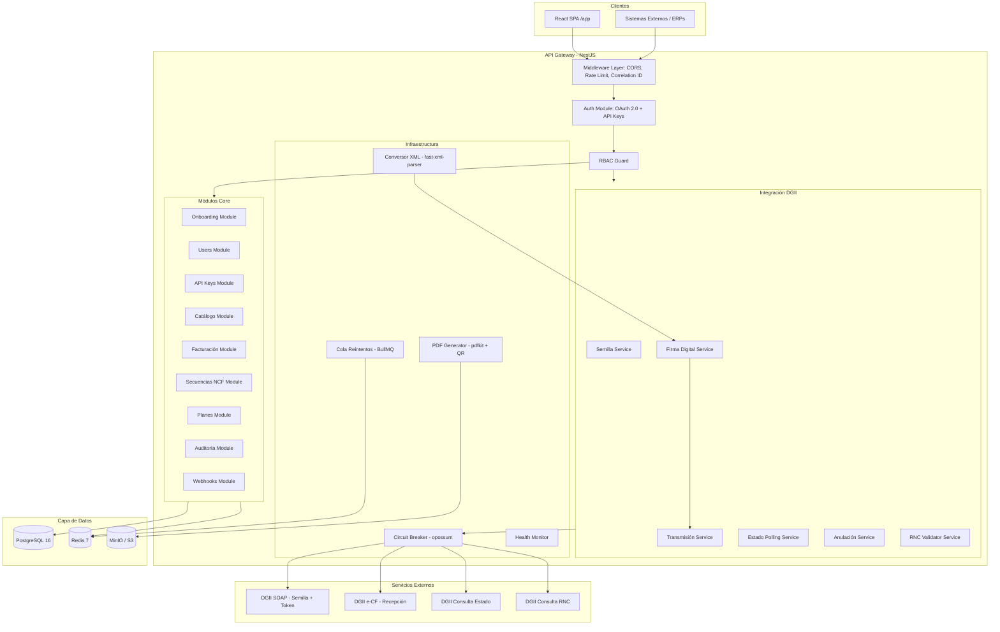
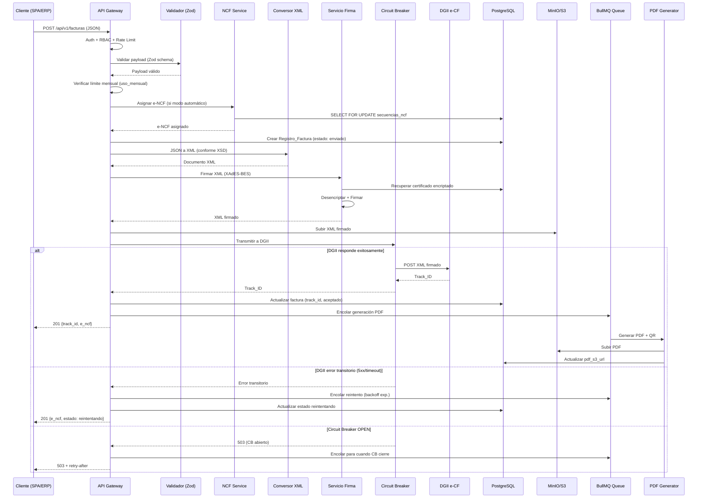
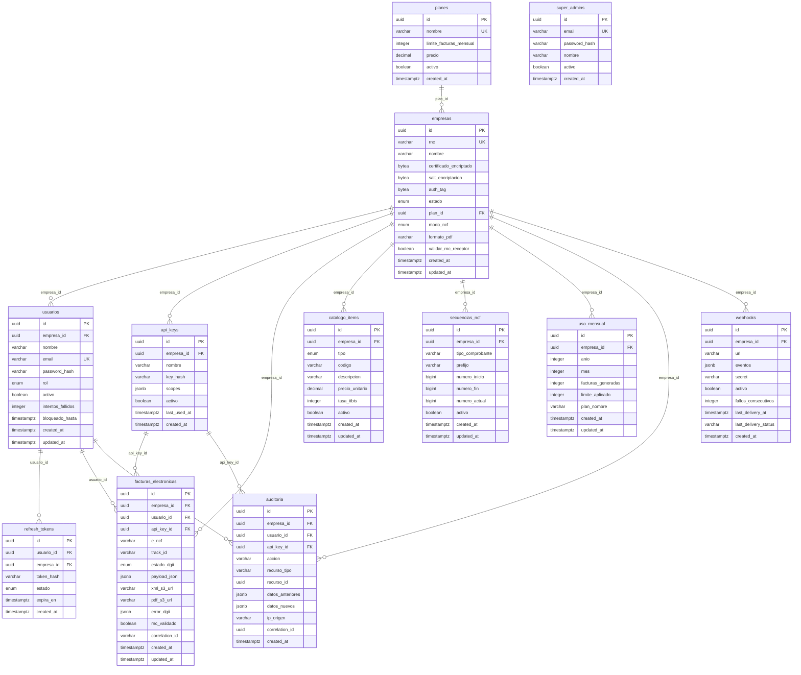

# Documento de Diseño Técnico

## Overview

Este documento describe la arquitectura y diseño técnico del API Gateway REST para facturación electrónica (e-CF) de la DGII de República Dominicana. El sistema actúa como middleware entre los sistemas de facturación de PYMEs y la plataforma e-CF de la DGII, gestionando el ciclo de vida completo de comprobantes fiscales electrónicos.

### Decisiones de Diseño Clave

1. **NestJS Modular**: Arquitectura basada en módulos NestJS con inyección de dependencias para desacoplamiento y testabilidad.
2. **Multi-tenencia por filtro de consulta**: Aislamiento de datos mediante `empresa_id` en todas las consultas, sin schemas separados por tenant.
3. **Abstracción de infraestructura**: Interfaces para almacenamiento de objetos y gestión de secretos, permitiendo intercambio entre MinIO/S3 y env/Secrets Manager.
4. **Autenticación dual**: OAuth 2.0 (JWT RS256) para usuarios humanos y API Keys (SHA-256 hash) para sistemas externos, ambos resueltos a un contexto de autorización unificado.
5. **Resiliencia con Circuit Breaker + Cola de Reintentos**: opossum para circuit breaker y BullMQ para colas con backoff exponencial.
6. **Firma digital con xadesjs**: Implementación XAdES-BES usando la librería xadesjs basada en Web Crypto API.

### Hallazgos de Investigación

- **xadesjs** (PeculiarVentures): Implementación TypeScript de XAdES basada en XMLDSIGjs, compatible con Node.js via Web Crypto. Soporta firmas enveloped con XAdES-BES.
- **opossum**: Circuit breaker para Node.js que monitorea funciones asíncronas. Configurable con umbrales de fallo, timeouts y períodos de reset.
- **BullMQ**: Cola de mensajes sobre Redis con soporte nativo para backoff exponencial, reintentos configurables y workers concurrentes.
- **@nestjs/bull**: Integración oficial de NestJS con BullMQ para procesamiento de trabajos en background.

## Architecture

### Diagrama de Arquitectura de Alto Nivel



### Diagrama de Flujo de Facturación (Flujo Principal)



### Estructura de Carpetas del Proyecto

```
src/
├── main.ts
├── app.module.ts
├── common/
│   ├── decorators/          # @CurrentUser, @Roles, @ApiKeyScopes
│   ├── filters/             # GlobalExceptionFilter
│   ├── guards/              # JwtAuthGuard, ApiKeyGuard, RolesGuard
│   ├── interceptors/        # CorrelationIdInterceptor, LoggingInterceptor
│   ├── middleware/           # RateLimitMiddleware
│   ├── interfaces/          # IStorageProvider, ISecretsProvider
│   └── pipes/               # ZodValidationPipe
├── modules/
│   ├── auth/                # AuthModule (OAuth 2.0 + API Keys)
│   ├── onboarding/          # OnboardingModule
│   ├── users/               # UsersModule (CRUD usuarios)
│   ├── api-keys/            # ApiKeysModule
│   ├── empresas/            # EmpresasModule
│   ├── catalogo/            # CatalogoModule
│   ├── facturas/            # FacturasModule (core facturación)
│   ├── secuencias-ncf/      # SecuenciasNcfModule
│   ├── planes/              # PlanesModule (suscripciones)
│   ├── auditoria/           # AuditoriaModule
│   ├── webhooks/            # WebhooksModule
│   └── admin/               # AdminModule (Super_Admin)
├── dgii/
│   ├── dgii.module.ts
│   ├── semilla.service.ts
│   ├── token.service.ts
│   ├── firma.service.ts
│   ├── transmision.service.ts
│   ├── estado-polling.service.ts
│   ├── anulacion.service.ts
│   ├── rnc-validator.service.ts
│   ├── conversor-xml.service.ts
│   └── circuit-breaker.service.ts
├── infrastructure/
│   ├── storage/
│   │   ├── storage.interface.ts
│   │   ├── minio-storage.adapter.ts
│   │   └── s3-storage.adapter.ts
│   ├── secrets/
│   │   ├── secrets.interface.ts
│   │   ├── env-secrets.adapter.ts
│   │   └── aws-secrets.adapter.ts
│   ├── queue/
│   │   ├── retry-queue.module.ts
│   │   └── retry-queue.processor.ts
│   └── pdf/
│       ├── pdf-generator.service.ts
│       └── qr-generator.service.ts
├── database/
│   ├── migrations/
│   ├── entities/
│   └── database.module.ts
└── health/
    ├── health.module.ts
    └── health.controller.ts
```

## Components and Interfaces

### 1. Módulo de Autenticación (AuthModule)

Maneja autenticación dual: OAuth 2.0 para usuarios humanos y API Keys para sistemas externos. Resuelve ambos mecanismos a un RequestContext unificado.

```typescript
interface RequestContext {
  tipo: 'usuario' | 'api_key';
  empresa_id: string;
  rnc: string;
  usuario_id?: string;
  rol?: 'admin' | 'facturador' | 'lector';
  api_key_id?: string;
  scopes?: string[];
}

interface IAuthService {
  login(email: string, password: string): Promise<TokenPair>;
  refresh(refreshToken: string): Promise<TokenPair>;
  logout(refreshToken: string): Promise<void>;
  validateAccessToken(token: string): Promise<RequestContext>;
}

interface TokenPair {
  access_token: string;   // JWT RS256, 15 min TTL
  refresh_token: string;  // UUID opaco, 7 días TTL
  expires_in: number;
  token_type: 'Bearer';
}

interface IApiKeyService {
  validate(apiKey: string): Promise<RequestContext>;
  create(empresaId: string, nombre: string, scopes: string[]): Promise<{ key: string; id: string }>;
  rotate(apiKeyId: string): Promise<{ key: string }>;
  revoke(apiKeyId: string): Promise<void>;
  listByEmpresa(empresaId: string): Promise<ApiKeyInfo[]>;
}
```

### 2. Servicio de Firma Digital (FirmaService)

Núcleo criptográfico del sistema. Gestiona la firma XAdES-BES para semillas y documentos e-CF.

```typescript
interface IFirmaService {
  firmarSemilla(semillaXml: string, empresaId: string): Promise<string>;
  firmarEcf(documentoXml: string, empresaId: string): Promise<string>;
}

// Algoritmo de firma XAdES-BES:
// 1. Recuperar certificado PKCS12 encriptado de PostgreSQL
// 2. Desencriptar con AES-256-GCM (key del Proveedor_Secretos)
// 3. Extraer clave privada RSA y cadena X.509 del PKCS12
// 4. Crear firma enveloped:
//    - Canonicalización: Exclusive XML Canonicalization (exc-c14n)
//    - Digest: SHA-256
//    - Algoritmo de firma: RSA-SHA256
//    - KeyInfo: cadena completa X.509
//    - SignedProperties: SigningCertificate (SHA-256) + SigningTime (UTC ISO 8601)
// 5. Retornar XML con firma ds:Signature embebida
```

### 3. Conversor XML (ConversorXmlService)

```typescript
interface IConversorXmlService {
  convertir(payload: FacturaPayload, encf: string): Promise<string>;
  recargarEsquema(): Promise<void>;
  getVersionEsquema(): string;
}
// Usa fast-xml-parser con preservación de orden de elementos,
// namespace management, encoding UTF-8, y validación post-conversión contra XSD.
```

### 4. Circuit Breaker (CircuitBreakerService)

```typescript
interface ICircuitBreakerService {
  execute<T>(operation: () => Promise<T>, context: string): Promise<T>;
  getState(): 'CLOSED' | 'OPEN' | 'HALF-OPEN';
  getTimeToHalfOpen(): number;
}
// Configuración opossum:
// - timeout: 30000 ms
// - resetTimeout: 30000 ms (30s en OPEN antes de HALF-OPEN)
// - volumeThreshold: 5 (mínimo 5 solicitudes)
// - rollingCountTimeout: 60000 ms (ventana de 60s)
```

### 5. Cola de Reintentos (RetryQueueService)

```typescript
interface IRetryQueueService {
  encolarTransmision(job: TransmisionJob): Promise<string>;
  encolarSubida(job: SubidaJob): Promise<string>;
  pausar(): Promise<void>;
  reanudar(): Promise<void>;
}

interface TransmisionJob {
  factura_id: string;
  empresa_id: string;
  xml_firmado: string;
  correlation_id: string;
  intento: number;
}
// BullMQ config: attempts=5, backoff exponential delay=5000ms
// Delays: 5s, 10s, 20s, 40s, 80s
```

### 6. Infraestructura Abstracta

```typescript
interface IStorageProvider {
  upload(bucket: string, key: string, data: Buffer, contentType: string): Promise<string>;
  download(bucket: string, key: string): Promise<Buffer>;
  getPresignedUrl(bucket: string, key: string, ttlSeconds: number): Promise<string>;
  delete(bucket: string, key: string): Promise<void>;
}

interface ISecretsProvider {
  getEncryptionKey(): Promise<Buffer>;
  getJwtPrivateKey(): Promise<string>;
  getJwtPublicKey(): Promise<string>;
}
```

### 7. Generador de PDF (PdfGeneratorService)

```typescript
interface IPdfGeneratorService {
  generarFacturaPdf(factura: RegistroFactura, formato: 'ticket' | 'carta'): Promise<Buffer>;
}

interface IQrGeneratorService {
  generar(data: QrPayload): Promise<Buffer>;
}

interface QrPayload {
  url_dgii: string;
  rnc_emisor: string;
  rnc_receptor: string;
  encf: string;
  monto_total: string; // 2 decimales, sin símbolo
}
```

### 8. Servicio de Handshake DGII (DgiiTokenService)

```typescript
interface IDgiiTokenService {
  obtenerToken(empresaId: string): Promise<string>;
}
// Flujo:
// 1. Buscar en Redis: dgii_token:{empresa_id}
// 2. Si existe -> retornar token cacheado
// 3. Si no: solicitar semilla SOAP (10s) -> firmar -> enviar firmada (10s)
// 4. Almacenar token en Redis con TTL 3540s (59 min)
// 5. Si Redis inalcanzable -> handshake sin cache (log WARNING)
```

### 9. Servicio de Secuencias NCF (SecuenciasNcfService)

```typescript
interface ISecuenciasNcfService {
  asignarSiguiente(empresaId: string, tipoComprobante: string): Promise<string>;
  validarFormato(encf: string): boolean;
  crear(data: CrearSecuenciaDto): Promise<SecuenciaNcf>;
  listar(empresaId: string): Promise<SecuenciaNcf[]>;
  desactivar(id: string, empresaId: string): Promise<void>;
  obtenerEstado(empresaId: string): Promise<EstadoSecuencias[]>;
}
// Asignación atómica con SELECT FOR UPDATE:
// BEGIN -> SELECT FOR UPDATE -> verificar rango -> UPDATE numero_actual+1 -> COMMIT
// Retorna: prefijo + LPAD(numero_actual, 8, '0')
```

### 10. Webhooks Service (WebhooksService)

```typescript
interface IWebhooksService {
  configurar(empresaId: string, config: WebhookConfig): Promise<Webhook>;
  disparar(empresaId: string, evento: WebhookEvent): Promise<void>;
  listar(empresaId: string): Promise<Webhook[]>;
  desactivar(webhookId: string): Promise<void>;
  probar(webhookId: string): Promise<WebhookTestResult>;
}

interface WebhookEvent {
  event_type: string;
  timestamp: string;
  empresa_id: string;
  data: Record<string, unknown>;
}
// Entrega: timeout 10s, reintentos 3 (10s, 30s, 90s)
// HMAC-SHA256 en header X-Webhook-Signature si secret configurado
// Auto-desactivación tras 10 fallos consecutivos
```

## Data Models

### Diagrama Entidad-Relación



### Restricciones e Índices Clave

```sql
-- Índices de rendimiento
CREATE INDEX idx_facturas_empresa_id ON facturas_electronicas(empresa_id);
CREATE INDEX idx_facturas_estado_dgii ON facturas_electronicas(estado_dgii);
CREATE INDEX idx_facturas_created_at ON facturas_electronicas(created_at);
CREATE INDEX idx_catalogo_empresa_activo ON catalogo_items(empresa_id, activo);
CREATE INDEX idx_auditoria_empresa_created ON auditoria(empresa_id, created_at);
CREATE INDEX idx_refresh_tokens_hash ON refresh_tokens(token_hash);
CREATE INDEX idx_api_keys_hash ON api_keys(key_hash);

-- Restricciones UNIQUE
ALTER TABLE secuencias_ncf ADD CONSTRAINT uq_secuencia_empresa_tipo_prefijo 
  UNIQUE(empresa_id, tipo_comprobante, prefijo);
ALTER TABLE uso_mensual ADD CONSTRAINT uq_uso_empresa_periodo 
  UNIQUE(empresa_id, anio, mes);

-- Restricciones de integridad
ALTER TABLE facturas_electronicas 
  ADD CONSTRAINT chk_actor 
  CHECK (usuario_id IS NOT NULL OR api_key_id IS NOT NULL);
```

### Enumeraciones

```typescript
enum EstadoEmpresa { ACTIVO = 'activo', CERTIFICACION = 'certificacion', INACTIVO = 'inactivo' }
enum RolUsuario { ADMIN = 'admin', FACTURADOR = 'facturador', LECTOR = 'lector' }
enum ModoNcf { AUTOMATICO = 'automatico', MANUAL = 'manual' }
enum EstadoDgii {
  ENVIADO = 'enviado', ACEPTADO = 'aceptado', RECHAZADO = 'rechazado',
  REINTENTANDO = 'reintentando', FALLIDO = 'fallido',
  APROBADO = 'aprobado', RECHAZADO_DEFINITIVO = 'rechazado_definitivo', ANULADO = 'anulado'
}
enum TipoComprobante { E31 = 'E31', E32 = 'E32', E33 = 'E33', E34 = 'E34',
  E41 = 'E41', E43 = 'E43', E44 = 'E44', E45 = 'E45' }
enum TipoCatalogo { PRODUCTO = 'producto', SERVICIO = 'servicio' }
```

## Correctness Properties

*A property is a characteristic or behavior that should hold true across all valid executions of a system-essentially, a formal statement about what the system should do. Properties serve as the bridge between human-readable specifications and machine-verifiable correctness guarantees.*

### Property 1: Round-trip de encriptación AES-256-GCM

*For any* secuencia de bytes representando un certificado PKCS12, encriptar con AES-256-GCM (generando un IV aleatorio de 12 bytes) y luego desencriptar con la misma clave y el IV/auth_tag almacenados debe producir la secuencia de bytes original idéntica.

**Validates: Requirements 1.7, 6.1, 17.1, 17.3**

### Property 2: Aislamiento multi-tenencia

*For any* par de empresas A y B, y cualquier consulta ejecutada en el contexto del tenant A (facturas, catálogo, usuarios, secuencias NCF, auditoría), los resultados nunca deben contener registros cuyo empresa_id corresponda a B. Cualquier intento de acceder a un recurso de B desde el contexto de A debe resultar en un rechazo 403.

**Validates: Requirements 18.2, 18.5, 18.7, 25.2, 25.6, 16.5, 3.4, 3.5**

### Property 3: Enforcement RBAC por rol

*For any* usuario con rol R e intento de ejecutar una operación que requiere rol mínimo M, el acceso debe ser concedido si y solo si R tiene privilegios iguales o superiores a M en la jerarquía admin > facturador > lector.

**Validates: Requirements 3.2, 4.5, 17.7, 25.5, 28.12, 30.5, 31.3**

### Property 4: Unicidad de RNC y email en registro

*For any* valor de RNC o email que ya existe en la base de datos, un intento de registro con ese mismo valor debe ser rechazado sin crear registros duplicados, retornando el código de error apropiado.

**Validates: Requirements 1.3, 1.4, 3.7**

### Property 5: Round-trip JWT emisión y verificación

*For any* usuario válido con claims (usuario_id, empresa_id, rnc, rol), emitir un Access_Token JWT firmado con RS256 y luego verificar ese token con la clave pública correspondiente debe extraer exactamente los mismos claims originales. Cualquier alteración de un solo bit en el token debe resultar en fallo de verificación.

**Validates: Requirements 2.1, 2.5, 2.12**

### Property 6: Round-trip API Key generación, hash y lookup

*For any* API Key generado como 256 bits aleatorios codificados en base64, almacenar su SHA-256 hash y luego buscar por SHA-256 del key original debe retornar el registro correcto con la empresa_id y scopes asociados. El key en texto plano nunca debe existir persistido en la base de datos.

**Validates: Requirements 2.1, 2.2, 2.7**

### Property 7: Rate limiting respeta umbrales configurados

*For any* fuente de solicitudes (usuario con límite de 100/min, o API key con límite de 1000/min), la solicitud número N+1 donde N es el límite aplicable dentro de una ventana de 1 minuto debe ser rechazada con 429 e incluir un header Retry-After con valor positivo. Las primeras N solicitudes deben ser aceptadas.

**Validates: Requirements 2.10, 2.6**

### Property 8: Autorización por scopes de API Key

*For any* API Key con conjunto de scopes S y operación que requiere scope R, el acceso debe ser concedido si y solo si R pertenece a S. Si R no está en S, la respuesta debe ser 403 Forbidden.

**Validates: Requirements 2.4, 2.5**

### Property 9: Validación de formato RNC

*For any* cadena de texto, es un RNC válido si y solo si está compuesta exclusivamente de dígitos numéricos (0-9) y tiene exactamente 9 o exactamente 11 caracteres de longitud. Cualquier otro valor debe ser rechazado por el validador.

**Validates: Requirements 8.3**

### Property 10: Invariante aritmética de montos de factura

*For any* conjunto de ítems de factura con cantidades mayores a cero, precios unitarios no negativos y tasas de ITBIS en el conjunto (0, 16, 18), el monto total debe ser igual a la suma de subtotales más la suma de ITBIS con tolerancia máxima de 0.01 por redondeo. Payloads donde el total difiere más allá de la tolerancia deben ser rechazados.

**Validates: Requirements 8.4**

### Property 11: Round-trip de conversión JSON a XML

*For any* payload JSON de factura que pasa la validación Zod, convertir a XML conforme al XSD y luego parsear ese XML de vuelta a una estructura de datos debe preservar todos los valores de campos con su precisión numérica y contenido semántico original.

**Validates: Requirements 9.4**

### Property 12: Verificación de firma digital XAdES-BES

*For any* documento XML válido y cualquier certificado PKCS12 no expirado, firmar el documento con XAdES-BES y luego verificar la firma usando la clave pública del certificado debe resultar exitoso. El XML firmado debe contener los elementos ds:Signature, KeyInfo con cadena X.509 completa, y xades:SignedProperties con SigningCertificate y SigningTime.

**Validates: Requirements 10.1, 10.2, 10.3, 10.4**

### Property 13: Máquina de estados del Circuit Breaker

*For any* secuencia de resultados de llamadas (éxito/fallo), el circuit breaker debe transicionar de CLOSED a OPEN tras 5 fallos consecutivos dentro de 60 segundos, permanecer en OPEN por 30 segundos antes de HALF-OPEN, transicionar a CLOSED con un éxito en HALF-OPEN, y volver a OPEN con un fallo en HALF-OPEN. En estado OPEN debe rechazar todas las solicitudes sin enviarlas al endpoint.

**Validates: Requirements 12.1, 12.2, 12.3, 12.4, 12.5**

### Property 14: Cálculo de backoff exponencial

*For any* número de intento N donde 1 es menor o igual que N y N es menor o igual que 5, el retraso de backoff debe ser exactamente 5 por 2 elevado a (N-1) segundos, produciendo la secuencia 5s, 10s, 20s, 40s, 80s. Tras el intento 5, no deben programarse más reintentos.

**Validates: Requirements 19.1, 19.2**

### Property 15: Asignación atómica de e-NCF

*For any* secuencia NCF activa con numero_actual menor o igual que numero_fin, la asignación debe retornar un e-NCF formateado como prefijo concatenado con el número con ceros a la izquierda e incrementar numero_actual en 1. Para N solicitudes concurrentes, los N e-NCFs asignados deben ser todos distintos y secuenciales sin huecos.

**Validates: Requirements 28.7, 28.9, 28.11**

### Property 16: Enforcement de límite mensual de facturas

*For any* empresa con un plan que tiene limite_facturas_mensual no nulo, cuando facturas_generadas es mayor o igual que limite_facturas_mensual, el envío de una nueva factura debe ser rechazado con 402. Cuando facturas_generadas es menor que el límite, el envío debe ser permitido. Empresas con límite NULL nunca deben ser bloqueadas por este control.

**Validates: Requirements 27.3, 27.4, 27.5**

### Property 17: Formato de payload QR según patrón DGII

*For any* conjunto de parámetros de factura (RNC emisor, RNC receptor, e-NCF, monto total), el payload del QR debe contener todos los parámetros concatenados según el patrón de URL de verificación de la DGII, con el monto formateado a exactamente 2 decimales sin símbolo de moneda.

**Validates: Requirements 14.1, 14.3**

### Property 18: Firma HMAC-SHA256 de webhooks

*For any* cuerpo de solicitud JSON y cualquier secreto configurado, el header X-Webhook-Signature debe contener exactamente el HMAC-SHA256 del cuerpo usando el secreto como clave. Para un mismo cuerpo y secreto, la firma debe ser determinista e idéntica en cada invocación.

**Validates: Requirements 32.3**

### Property 19: Propagación de Correlation ID

*For any* solicitud HTTP entrante, el ID_Correlacion (generado o extraído del header X-Correlation-ID) debe aparecer idénticamente en todas las entradas de log producidas durante el ciclo de vida de la solicitud, en el header de respuesta X-Correlation-ID, y en los trabajos encolados en la cola de reintentos.

**Validates: Requirements 21.1, 21.3, 21.4**

### Property 20: Búsqueda parcial case-insensitive en catálogo

*For any* Catalogo_Item con descripcion D y cualquier subcadena S de D con al menos 1 carácter, una búsqueda con el parámetro search=S en cualquier combinación de mayúsculas o minúsculas debe incluir ese ítem en los resultados retornados.

**Validates: Requirements 25.9**

### Property 21: Protección del último administrador

*For any* empresa con exactamente un usuario activo con rol admin, cualquier intento de desactivar ese usuario o cambiar su rol a uno inferior debe ser rechazado con 409 Conflict. La empresa debe mantener siempre al menos un admin activo.

**Validates: Requirements 3.8**

### Property 22: Validación condicional de e-NCF según modo

*For any* empresa con modo_ncf igual a manual, el campo e_ncf es requerido en el payload de factura y su ausencia produce error 400. Para cualquier empresa con modo_ncf igual a automatico, el campo e_ncf es ignorado si se provee y el sistema asigna automáticamente desde la secuencia activa.

**Validates: Requirements 8.6, 28.7, 28.8**

### Property 23: Bloqueo por intentos fallidos de login

*For any* dirección de email, tras 5 intentos de login fallidos consecutivos dentro de una ventana de 15 minutos, el siguiente intento debe ser rechazado con 429 independientemente de si las credenciales son correctas. Tras el período de bloqueo de 15 minutos, los intentos deben ser permitidos nuevamente.

**Validates: Requirements 2.9**

### Property 24: Refresh token revoca el anterior

*For any* refresh token válido y no expirado, al ejecutar la operación de refresh el token original debe quedar con estado revocado y no debe poder ser usado nuevamente, mientras que el nuevo token debe ser funcional para obtener un nuevo access token.

**Validates: Requirements 2.3, 2.4**

### Property 25: Validación de scopes permitidos

*For any* conjunto de scopes proporcionado al crear un API Key, todos los valores deben pertenecer al conjunto válido (facturas:write, facturas:read, pdf:read, estado:read). Si algún valor no pertenece al conjunto, la creación debe ser rechazada con 400 Bad Request.

**Validates: Requirements 4.7, 4.8**

## Error Handling

### Estrategia Global de Errores

El sistema implementa un GlobalExceptionFilter en NestJS que captura todas las excepciones no manejadas y las transforma en respuestas HTTP estructuradas.

### Formato de Respuesta de Error

```typescript
interface ErrorResponse {
  statusCode: number;
  error: string;
  message: string;
  details?: ErrorDetail[];
  correlation_id: string;
  timestamp: string;
}

interface ErrorDetail {
  field: string;
  message: string;
  code: string;
}
```

### Clasificación de Errores por Código HTTP

| Código | Uso | Ejemplo |
|--------|-----|---------|
| 400 | Payload inválido (Zod, formato) | Campo requerido faltante, RNC mal formateado |
| 401 | Autenticación fallida | Token expirado, API key inválido |
| 402 | Límite de plan alcanzado | facturas_generadas >= limite |
| 403 | Autorización insuficiente | Rol inadecuado, cross-tenant |
| 404 | Recurso no encontrado | Factura inexistente |
| 409 | Conflicto de estado | NCF agotado, email duplicado, último admin |
| 422 | Rechazo de negocio DGII | Factura rechazada por DGII |
| 429 | Rate limit o bloqueo | Exceso de solicitudes |
| 500 | Error interno | Fallo de firma, error DB |
| 502 | Respuesta inválida de DGII | Semilla XML malformada |
| 503 | Servicio no disponible | DGII inalcanzable, CB abierto |

### Manejo por Capa

- **Controller Layer**: Captura HttpExceptions, propaga correlation_id en respuesta.
- **Service Layer**: Lanza excepciones tipadas (DomainException), loguea con nivel apropiado.
- **Infrastructure Layer**: Retry automático para errores transitorios, circuit breaker para externos.
- **Global Exception Filter**: Catch-all, transforma a ErrorResponse, log ERROR + stack trace.

### Excepciones de Dominio Específicas

```typescript
class DgiiSemillaException extends ServiceUnavailableException {}
class DgiiTokenException extends UnauthorizedException {}
class DgiiTransmisionException extends UnprocessableEntityException {
  constructor(public codigosDgii: DgiiErrorCode[]) { super(); }
}
class CertificadoException extends UnauthorizedException {}
class SecuenciaAgotadaException extends ConflictException {}
class LimitePlanException extends PaymentRequiredException {}
```

### Compensación y Recuperación

| Escenario | Acción |
|-----------|--------|
| Subida XML/PDF a S3 falla | Mantener url=null, encolar reintento (max 3) |
| Token DGII expirado en transmisión | Invalidar cache, re-handshake, reintentar 1 vez |
| Redis inalcanzable (cache) | Handshake sin cache, log WARNING |
| Error DB al crear factura | Abortar, NO firmar ni transmitir, retornar 500 |
| Circuit Breaker OPEN | Encolar en BullMQ, pausar workers, retornar 503 |

## Testing Strategy

### Enfoque Dual: Unit Tests + Property-Based Tests

- **Unit tests (Jest)**: Verifican ejemplos específicos, edge cases y condiciones de error.
- **Property-based tests (fast-check)**: Verifican propiedades universales que deben mantenerse para todos los inputs válidos.

Ambos son complementarios: unit tests capturan bugs concretos, property tests verifican correctitud general.

### Librería de Property-Based Testing

- **Librería**: fast-check v3.x
- **Justificación**: Librería PBT madura para TypeScript/JavaScript, excelente soporte de generadores, integración con Jest, shrinking automático.
- **Configuración**: Mínimo 100 iteraciones por propiedad (numRuns: 100)
- **Etiquetado**: Cada test incluye comentario referenciando la propiedad del diseño.
- **Tag format**: Feature: e-ncf-api-gateway, Property {N}: {título}

### Estructura de Tests

```
test/
├── unit/
│   ├── auth/
│   ├── dgii/
│   ├── facturas/
│   └── infrastructure/
├── property/
│   ├── encryption-roundtrip.property.spec.ts       # Property 1
│   ├── multi-tenancy.property.spec.ts              # Property 2
│   ├── rbac-enforcement.property.spec.ts           # Property 3
│   ├── uniqueness.property.spec.ts                 # Property 4
│   ├── jwt-roundtrip.property.spec.ts              # Property 5
│   ├── apikey-hash.property.spec.ts                # Property 6
│   ├── rate-limiting.property.spec.ts              # Property 7
│   ├── scope-authorization.property.spec.ts        # Property 8
│   ├── rnc-validation.property.spec.ts             # Property 9
│   ├── amount-arithmetic.property.spec.ts          # Property 10
│   ├── json-xml-roundtrip.property.spec.ts         # Property 11
│   ├── xades-signature.property.spec.ts            # Property 12
│   ├── circuit-breaker-fsm.property.spec.ts        # Property 13
│   ├── backoff-calculation.property.spec.ts        # Property 14
│   ├── ncf-assignment.property.spec.ts             # Property 15
│   ├── invoice-limit.property.spec.ts              # Property 16
│   ├── qr-payload-format.property.spec.ts          # Property 17
│   ├── webhook-hmac.property.spec.ts               # Property 18
│   ├── correlation-id.property.spec.ts             # Property 19
│   ├── catalog-search.property.spec.ts             # Property 20
│   ├── last-admin-protection.property.spec.ts      # Property 21
│   ├── ncf-mode-validation.property.spec.ts        # Property 22
│   ├── login-lockout.property.spec.ts              # Property 23
│   ├── refresh-token-revocation.property.spec.ts   # Property 24
│   └── scope-validation.property.spec.ts           # Property 25
├── integration/
│   ├── dgii-handshake.integration.spec.ts
│   ├── dgii-transmision.integration.spec.ts
│   ├── storage-upload.integration.spec.ts
│   └── webhook-delivery.integration.spec.ts
└── e2e/
    ├── onboarding.e2e.spec.ts
    ├── facturacion-flow.e2e.spec.ts
    └── auth-flow.e2e.spec.ts
```

### Ejemplo de Property Test con fast-check

```typescript
// test/property/rnc-validation.property.spec.ts
import fc from 'fast-check';
import { validarRnc } from '../../src/modules/facturas/validadores/rnc.validator';

describe('RNC Validation Properties', () => {
  // Feature: e-ncf-api-gateway, Property 9: Validación de formato RNC
  it('acepta cadenas de exactamente 9 dígitos numéricos', () => {
    fc.assert(
      fc.property(
        fc.stringOf(
          fc.constantFrom('0','1','2','3','4','5','6','7','8','9'),
          { minLength: 9, maxLength: 9 }
        ),
        (rnc) => { expect(validarRnc(rnc)).toBe(true); }
      ),
      { numRuns: 100 }
    );
  });

  it('rechaza cadenas con caracteres no numéricos', () => {
    fc.assert(
      fc.property(
        fc.string({ minLength: 9, maxLength: 11 }).filter(s => /[^0-9]/.test(s)),
        (rnc) => { expect(validarRnc(rnc)).toBe(false); }
      ),
      { numRuns: 100 }
    );
  });
});
```

### Ejemplo de Property Test Round-Trip

```typescript
// test/property/json-xml-roundtrip.property.spec.ts
import fc from 'fast-check';
import { convertirJsonAXml } from '../../src/dgii/conversor-xml.service';
import { parsearXmlAJson } from '../../src/dgii/xml-parser.util';
import { facturaArbitrary } from '../arbitraries/factura.arbitrary';

describe('JSON-XML Round-Trip', () => {
  // Feature: e-ncf-api-gateway, Property 11: Round-trip JSON a XML
  it('preserva todos los valores tras conversión y parseo', () => {
    fc.assert(
      fc.property(facturaArbitrary, (factura) => {
        const xml = convertirJsonAXml(factura, 'E310000001');
        const parsed = parsearXmlAJson(xml);
        expect(parsed.rnc_emisor).toBe(factura.rnc_emisor);
        expect(parsed.rnc_receptor).toBe(factura.rnc_receptor);
        expect(parsed.items.length).toBe(factura.items.length);
        for (let i = 0; i < factura.items.length; i++) {
          expect(parsed.items[i].precio_unitario)
            .toBeCloseTo(factura.items[i].precio_unitario, 2);
        }
      }),
      { numRuns: 100 }
    );
  });
});
```

### Tests de Integración

- **Testcontainers** para PostgreSQL y Redis en CI
- **Mocks de DGII** con respuestas XML pregrabadas
- **MinIO en Docker** para tests de almacenamiento
- **Supertest** para tests E2E de la API HTTP

### Cobertura Esperada

| Capa | Objetivo | Propiedades Relacionadas |
|------|----------|--------------------------|
| Validadores (Zod, RNC, montos) | 95% | Properties 9, 10, 22, 25 |
| Servicios Core (auth, NCF, planes) | 90% | Properties 3-8, 15-16, 21, 23-24 |
| Integración DGII | 70% | Properties 12, 13, 14 |
| Conversor XML + Firma | 85% | Properties 1, 11, 12 |
| Infraestructura (Storage, Secrets) | 80% | Property 1 |
| Multi-tenencia | 90% | Property 2 |
